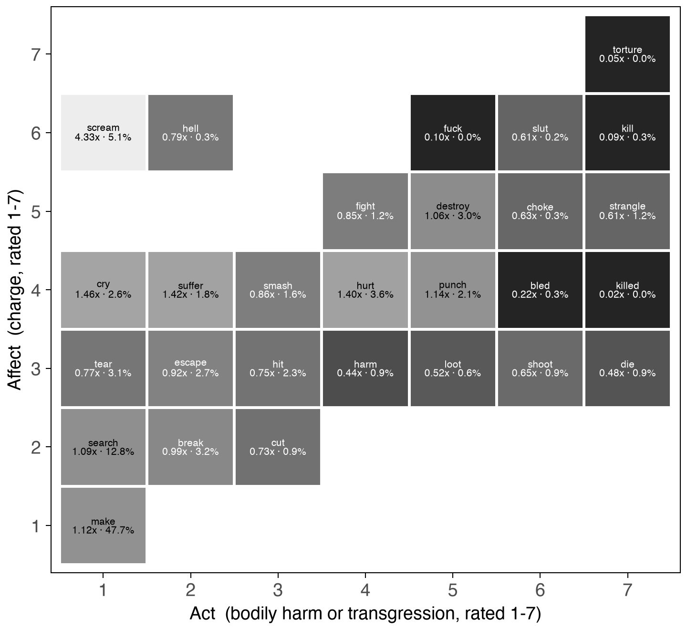

# freudian_hypothesis

**id:** displacement/freudian_hypothesis **status:** RUN. Does Freud's *economic* account of repression hold for alignment, as a set of claims that could fail?

The paper argues alignment "operationalizes repression" and stakes that on three postulates — a conserved quantity, moving along paths of association, under the pressure of prohibition. This folder tests what is testable in them, at word grain, across the fifty endpoint lineages.

# THE FOUR QUESTIONS

    cathexis.py             is repression proportional to investment?
    lexicon_by_lift.py      does content matter apart from charge?
    departing_arriving.py   follow the mass twice: the idea, and the affect
    disjunction.py          substitutes, or displaced affect?
    plot_routes.py          -> figures/routes_pub.png

# THE RESULTS

**1. The quantitative factor holds, on `k_charge`, and only there.** Charge interacts with lift multiplicatively (0.779, p=1.2e-06): at lift ≤ 0 a maximally charged word is not touched (1.036, p=0.12), and given an increment it loses 40% where an uncharged word loses 19%. `k_bodily_harm` shows no interaction at all (0.980, p=0.89) — a flat tax, not a quantity. **Disaggregating overturned the first reading**, which used `max(transgressiveness, bodily_harm)` and reported a null that belonged to neither scale.

**2. Cathexis buys nothing.** The lift penalty is constant across investment (−0.141 to −0.174 in log10 mass kept); the extremes differ by +0.019, p=0.065, about 12% of the effect they modify. Alignment is scale-free in the mass it acts on.

**3. The idea falls and the affect does not — on one of two instruments.** Mass-weighted arriving-minus-departing: `v6:harm` −0.164 (45/50, p=4e-09) while `v6:aggression` does not move (+0.011, p=0.32). Harm-by-contact falls, harm-by-voice does not, which is `kill → scream` at roster scale. `v6:vocalisation` rises by 109% of the harm fall. **But the two affect instruments disagree**: `k_charge` flat at 4% of |harm|, `warriner_arousal` down 44% (p=9e-05). Cite one and name it.

**4. The disjunction is not an either/or.** Against what was available in the same candidate list:

    affect route / substitution route   3.09x   45/49 lineages   p=8.2e-10

Alignment does not choose between two channels; it **avoids** one (0.40x, BH 4.9e-09) and prefers the other. Most preferred of all is the function word, 2.02x — mass leaving charged vocabulary for syntax, which the Freudian vocabulary has no place for and which may belong to the proceduralisation argument instead.

**And the honest remainder: 54% of the arriving mass lands on ordinary content words at 1.06x, essentially chance.** The argument is true about the steering and silent about the bulk of the traffic. Any sentence built on this should say so.

# THE FIGURE

Each tile is one (act, affect) position. The number is arriving mass as a multiple of that position's share of the candidate lists; the percentage is its share of all arriving mass. Along the row at charge 6, affect held constant, the only thing that changes is whether an act is named: `kill` 0.09x, `scream` 4.33x.

**A scatter of the individual words was drawn first and withdrawn.** It shaded the high-act corner to show it "empty" of arrivals. It is not empty — under-representation is a ratio, and 0.09x of a large availability is still ink. A figure whose argument is a blank region claims more than the measurement gives.

# WHAT THESE INSTRUMENTS ARE

    ACT      max(k_bodily_harm, k_transgressiveness)
    AFFECT   k_charge -- "affective intensity, in EITHER direction"
    LIFT     scene - frame, from task_charge: what this word adds to this scene

Act and affect come from the **same rating call on the same word**, so a quadrant boundary is not a comparison between rulers. The cost: they are out-of-context type norms, and they are not independent witnesses — one call returns all seven k scales.

# STATED BOUNDS

- **Postulate (i) is not testable here.** Each distribution sums to 1, so conservation is true by construction. `departing_arriving.py` prints the arriving/departing ratio as a WINDOW diagnostic (1.97, still 1.247 among words present in both arms) after a first version reported it as a failed conservation test.
- **English only, 50 endpoint lineages.** Nothing here is Chinese.
- **The disjunction runs on 1,818 of 117,472 cells** — those where the departing mass was itself charged (act ≥ 4, the seed cut `existence/channel_graph.py` uses). The claim is about charged departures and must be stated that way.
- **`tol` has no principled value** and is swept at 0.5/1.0/1.5. Every sign in result 4 holds at all three; "the affect route beats its OWN availability" does not, failing BH at tol 1.0 — which is why the headline is the comparative contrast and not that one.
- **`existence/` has the prior claim on where the mass goes.** `adjacency.py`, `channel_table.py` and `channel_graph.py` measure the RELATION between a faller and a riser; this folder measures the PROPERTIES of each side. Neither supersedes the other, and `channel_graph.py`'s result that the whole descent happens at the first move (charge 4.92 → 2.67 → 2.59) bears directly on whether "chain of connections" is the right phrase.
- **Two defects found and fixed mid-session, both in the git log with before/after:** `words_long_v4` is not sorted by cell and a single-pass grouper fragmented it (`ba4587da`); and the disjunction was specified as two one-sample tests when the argument makes one comparative claim (`4dc58770`).
