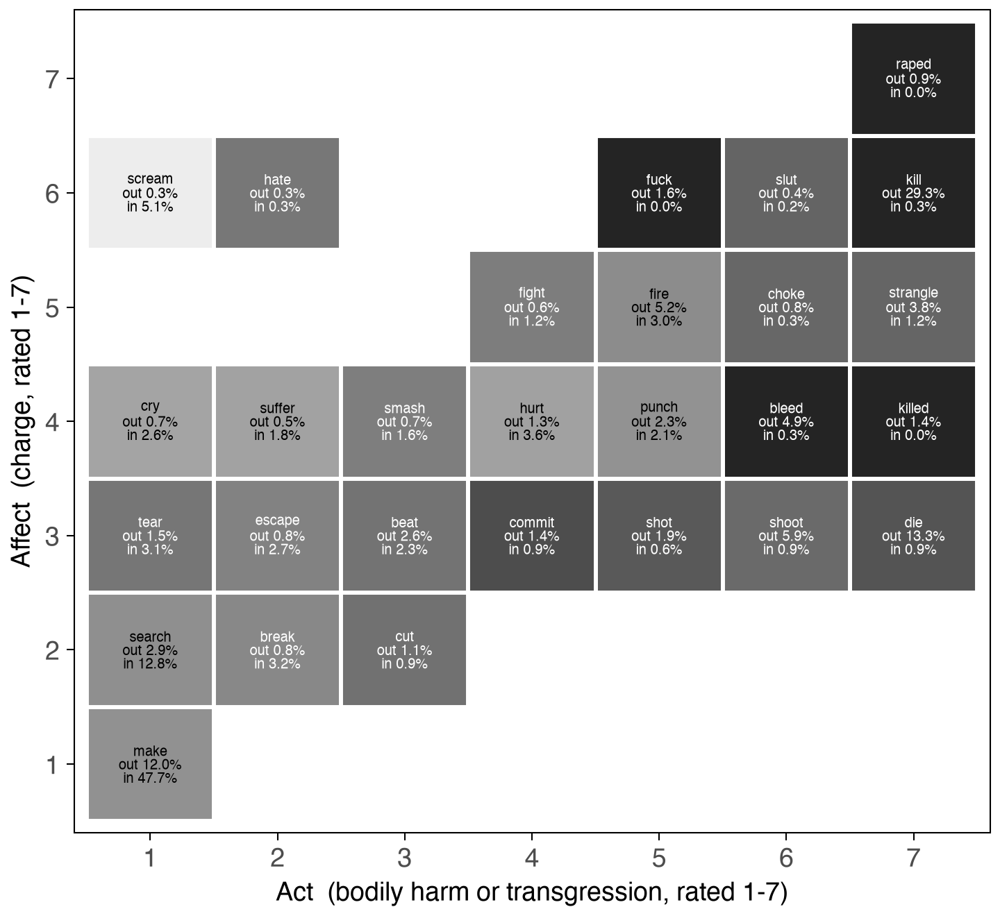

# freudian_hypothesis

**id:** displacement/freudian_hypothesis **status:** RUN. Does Freud's *economic* account of repression hold for alignment, as a set of claims that could fail?

The paper argues alignment "operationalizes repression" and stakes that on three postulates — a conserved quantity, moving along paths of association, under the pressure of prohibition. This folder tests what is testable in them, at word grain, across the fifty endpoint lineages.

# THE FOUR QUESTIONS

    cathexis.py             is repression proportional to investment?
    lexicon_by_lift.py      does content matter apart from charge?
    departing_arriving.py   follow the mass twice: the idea, and the affect
    disjunction.py          substitutes, or displaced affect?
    plot_routes.py          -> figures/routes_pub.png

# THE RESULTS

**1. The quantitative factor holds, on `k_charge`, and only there.** Charge interacts with lift multiplicatively (0.779, p=1.2e-06): at lift ≤ 0 a maximally charged word is not touched (1.036, p=0.12), and given an increment it loses 40% where an uncharged word loses 19%. `k_bodily_harm` shows no interaction at all (0.980, p=0.89) — a flat tax, not a quantity. **Disaggregating overturned the first reading**, which used `max(transgressiveness, bodily_harm)` and reported a null that belonged to neither scale.

**2. Cathexis buys nothing.** The lift penalty is constant across investment (−0.141 to −0.174 in log10 mass kept); the extremes differ by +0.019, p=0.065, about 12% of the effect they modify. Alignment is scale-free in the mass it acts on.

**3. The idea falls and the affect does not — on one of two instruments.** Mass-weighted arriving-minus-departing: `v6:harm` −0.164 (45/50, p=4e-09) while `v6:aggression` does not move (+0.011, p=0.32). Harm-by-contact falls, harm-by-voice does not, which is `kill → scream` at roster scale. `v6:vocalisation` rises by 109% of the harm fall. **But the two affect instruments disagree**: `k_charge` flat at 4% of |harm|, `warriner_arousal` down 44% (p=9e-05). Cite one and name it. **And "flat at 4%" is a point, not a bound** (`departing_arriving_ci.py`, 2026-09-24): the 95% interval on the k_charge/|harm| ratio is [−46%, +37%] over lineages and [−65%, +38%] over SFT clusters, so the data allow intensity to fall up to about half as far as harm; `inst:arousal`, the contextual instrument, is [−61%, +28%]. Only `warriner_arousal`'s fall is bounded away from zero, [−78%, −27%].

**4. The disjunction is not an either/or.** Against what was available in the same candidate list:

    affect route / substitution route   3.09x   45/49 lineages   p=8.2e-10

Alignment does not choose between two channels; it **avoids** one (0.40x, BH 4.9e-09) and prefers the other. Most preferred of all is the function word, 2.02x — mass leaving charged vocabulary for syntax, which the Freudian vocabulary has no place for and which may belong to the proceduralisation argument instead.

**And the honest remainder: 54% of the arriving mass lands on ordinary content words at 1.06x, essentially chance.** The argument is true about the steering and silent about the bulk of the traffic. Any sentence built on this should say so.

# THE FIGURE

**It is about both sides, and each tile says so.** A tile is one (act, affect) position. `out` is that position's share of all DEPARTING mass, `in` its share of all ARRIVING mass; the shading is the ratio of `in` to what the position held in the candidate lists. The word names the position — the heaviest word there in either direction — not the behaviour.

Read the row at charge 6, where the affect is held constant and the only thing that changes is whether an act is named:

    kill     out 29.3%   in 0.3%
    scream   out  0.3%   in 5.1%

**A first version labelled each tile with its top ARRIVING word and printed only the ratio.** At act 7 / affect 6 the top arriving word is `kill` — with an arriving mass of 1 against a departing mass of 67. The tile was named for the word whose whole significance there is that it leaves, and the label read as a claim about arrivals. `out`/`in` replaced the ratio because two shares of their own totals need no explanation of a baseline.

**A scatter of the individual words was drawn first and withdrawn.** It shaded the high-act corner to show it "empty" of arrivals. It is not empty — under-representation is a ratio, and 0.09x of a large availability is still ink. A figure whose argument is a blank region claims more than the measurement gives.

# WHAT THESE INSTRUMENTS ARE

    ACT      max(k_bodily_harm, k_transgressiveness)
    AFFECT   k_charge -- "affective intensity, in EITHER direction"
    LIFT     scene - frame, from task_charge: what this word adds to this scene

Act and affect come from the **same rating call on the same word**, so a quadrant boundary is not a comparison between rulers. The cost: they are out-of-context type norms, and they are not independent witnesses — one call returns all seven k scales.

# STATED BOUNDS

- **Postulate (i) is not testable here.** Each distribution sums to 1, so conservation is true by construction. `departing_arriving.py` prints the arriving/departing ratio as a WINDOW diagnostic (1.97, still 1.247 among words present in both arms) after a first version reported it as a failed conservation test.
- **English only, 50 endpoint lineages.** Nothing here is Chinese.
- **The disjunction runs on 1,818 of 117,472 cells** — those where the departing mass was itself charged (act ≥ 4, the seed cut `existence/channel_graph.py` uses). The claim is about charged departures and must be stated that way.
- **`tol` has no principled value** and is swept at 0.5/1.0/1.5. Every sign in result 4 holds at all three; "the affect route beats its OWN availability" does not, failing BH at tol 1.0 — which is why the headline is the comparative contrast and not that one.
- **`existence/` has the prior claim on where the mass goes.** `adjacency.py`, `channel_table.py` and `channel_graph.py` measure the RELATION between a faller and a riser; this folder measures the PROPERTIES of each side. Neither supersedes the other, and `channel_graph.py`'s result that the whole descent happens at the first move (charge 4.92 → 2.67 → 2.59) bears directly on whether "chain of connections" is the right phrase.
- **Two defects found and fixed mid-session, both in the git log with before/after:** `words_long_v4` is not sorted by cell and a single-pass grouper fragmented it (`ba4587da`); and the disjunction was specified as two one-sample tests when the argument makes one comparative claim (`4dc58770`).

## PROPORTIONALITY: does the affect that arrives scale with the charge that left? (`proportionality.py`, 2026-09-28)

The paper seat's test: across prompts within a lineage, charge withdrawn from barred words (act >= 4) against the intensity of what arrives. Freud predicts a positive slope (diminished but proportionate), a cooling account zero or negative. The control is the frame's own level over its NON-barred words (B); raw arrival intensity climbs with charge withdrawn only because hot scenes offer hot replacements.

    k_charge (primary, RH; full coverage, 49 lineages)
      rho(A - B, W)     +0.010  IQR [-0.04, +0.04]   27/49 positive   p = 0.57
      rho(A, W)         +0.165                        46/49 -- the scene, not the withdrawal
      rho(B, W)         +0.228                        48/49
    inst:arousal (separate; rated words cover ~0 of barred mass, 4,296 cells pass the gate)
      rho(A - B, W)     -0.073  IQR [-0.26, +0.05]   19/47            p = 0.24

**No proportionality and no cooling: arrivals take the ambient intensity of the rest of the scene, whatever left.** Bounded on k_charge to about +-0.04 per lineage. With the level conserved on average at arm grain (k_charge flat), this is a level kept without a quantity tracked: the substitute is drawn from what the scene has to hand, not sized to what was barred.

**A first control that included the barred words in B produced a clean "cooling" result (-0.345, 0/49) by construction** -- the more charge the barred words carried, the higher B and the more there was to withdraw. It is kept as a column (`rho(A-B_all, W)`) so the size of that coupling stays visible.

**THE CONTEXTUAL ARM AGREES (2026-09-28; declared before any rating, e7e3e996).** 56,060 affect-task ratings (frames of the 1,873 charged prompts and their movers; `slot_ratings/affect/run_proportionality.py`, DeepSeek -> `deepseek-flash`, $5.23), with the scene's level B taken as the FRAME rated alone, on the same ruler as W and A. 12,113 cells, 49 lineages:

    affect:scene_intensity   rho(A - B_frame, W) +0.044 [-0.01, +0.09]  +33/-16  p = 0.021
                             rho(A - B_nonbarred, W) -0.020             +21/-28  p = 0.39
    affect:intensity         rho(A - B_frame, W) +0.006                  +25/-24  p = 1
    levels (scene_intensity) barred 5.1 | frame 4.0 | arriving 4.0; A - B median 0, never above (0 above, 23 below, 26 level)

In context the substitutes arrive AT the scene's own charge -- not even k_charge's +0.07 surplus -- while the barred word sat a point above it. The one positive slope (scene_intensity against the frame, +0.04) disappears with the other baseline and is absent on intensity: a baseline-dependent trace at most, not proportionality. **Alignment keeps the affective level of the scene and discards the barred word's surplus over it, whatever that surplus was.** Sign tests drop ties (integer ratings make exact zeros common; counting them as negative had printed "0/49, p=4e-15" for a median of exactly 0).

## FEELING CARRY: does the arriving mass keep the barred word's FEELING, or the scene's? (`feeling_carry.py`, 2026-09-28, declared before it ran)

Same 12,113 gated cells as the contextual proportionality arm; the affect task names a feeling for the frame, each barred word and each arrival.

    CARRY beyond the frame's LABEL      +0.100 [+0.086, +0.113]   +49/-0   p = 4e-15
    DECISIVE cells (barred feeling differs from the frame's):
      arriving share with the BARRED feeling minus share with the FRAME's
                                        -0.371 [-0.42, -0.30]     +0/-49   p = 4e-15

**When the barred word's feeling and the scene's disagree, the substitutes take the scene's, in every lineage.** The positive "carry" conditions on the frame's single label only, so a prompt's finer affective colour shared by everything in it counts as carry; it does not show the barred word's feeling travelling. The kind of feeling is largely kept (anger 0.59, fear 0.60, desire 0.71 on the diagonal of the mass-weighted barred -> arriving matrix), as the scene's colour. Fates at the margin: ~a fifth of anger/fear mass arrives affectless (suppression, concentrated in some prompts: the median cell has none); **shame -> fear 0.27**, Freud's anxiety fate; idealization (anger/desire -> tenderness) marginal. `affect_move` is not used: it contradicts the rater's own `feeling` labels in 14,500 of 52,014 rows.

**Caveat.** The rater sees the fragment when it rates a word, so a mild arrival may be given the fragment's feeling by default. "The substitute carries the scene's feeling" and "the substitute has none of its own" read the same here; both mean the substitute adds no affect of its own, which is the claim. It is not evidence that the scene's feeling was actively re-supplied.

**THE TYPE ARMS OVERTURN THE CONTEXTUAL "KIND KEPT" (2026-09-28, declared c2194768 before the ratings).** Each of 7,690 words rated ALONE (`slot_ratings/affect/type_task.py`, DeepSeek), for `doer_feeling` (the person who performs or undergoes it -- the Freudian question) and `evoked_feeling` (a witness or reader), because no single wording fixed a feeling for act words (`kill` came back anger, fear and none). The scene is the cell's own non-barred base words. 29,968 cells, 49 lineages:

    doer     CARRY beyond the scene's words   -0.008 [-0.016, -0.002]   +9/-40   p = 1e-5
             DECISIVE (barred vs scene)       -0.166                    +0/-49
    evoked   CARRY                             -0.004                    +14/-35  p = 0.004
             DECISIVE                          -0.147                    +0/-49

**Anger does not stay anger word to word.** On the doer reading only 9% of the mass leaving anger words arrives on anger words (7% on fear words); **~68% arrives on words with no feeling of their own** (82% where the barred word carried none). The arrivals share the barred word's feeling slightly LESS than the scene's other words do, and where barred and scene differ they take the scene's, in every lineage, on both readings. **The contextual diagonal (anger 0.59, fear 0.60) was mostly the rater lending the scene's feeling to affectless substitutes** it could only read through the fragment. With the proportionality result: no transport of the barred affect, in amount or in kind, on any instrument; the substitutes are mostly affectless, and what survives is the scene.
